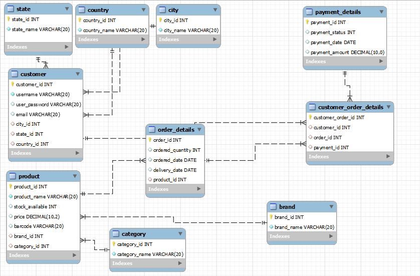

<<<<<<< HEAD
# React + Vite

This template provides a minimal setup to get React working in Vite with HMR and some ESLint rules.

Currently, two official plugins are available:

- [@vitejs/plugin-react](https://github.com/vitejs/vite-plugin-react/blob/main/packages/plugin-react/README.md) uses [Babel](https://babeljs.io/) for Fast Refresh
- [@vitejs/plugin-react-swc](https://github.com/vitejs/vite-plugin-react-swc) uses [SWC](https://swc.rs/) for Fast Refresh
=======
# Inventory-Management-System
Inventory Management System is a full-stack application using ReactJS for the frontend and Spring Boot for the backend, with MySQL as the database. It supports CRUD operations, including finding products by name or category. The application also generates customer and sales reports via backend APIs.

